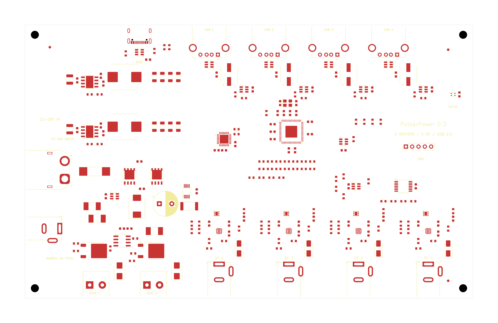

# PulsarPower — power distribution, dew control and USB hub

**PulsarPower** is the expanded power product derived from the original
**[PulsarDew](../pulsardew/README.md)** dew heater controller. It combines four
switched DC outlets, two dew heaters and a four-port USB 2.0 hub. Earlier design
documents call it **PulsarDew Hub**; the directory, KiCad filenames and Makefile
targets currently retain `pulsardewhub` as their internal project identifier.

Revision **0.3-draft**, reviewed with KiCad 10.0.6 on 2026-10-03. Open
`pulsardewhub.kicad_pro` in KiCad. This is a separate design derived from
PulsarDew, with **two PWM heaters, four individually switched and current-monitored
DC outlets, and four external USB 2.0 ports**. DC outlets use static on/off GPIO;
they must not be PWM controlled.

The schematic is electrically connected and the native PCB is a placed,
**unrouted 180 × 110 mm four-layer floorplan**. It is not ready for fabrication.
There are no tracks, vias or copper fills. No enclosure is assumed.

Review the [15-page schematic PDF](docs/schematic.pdf) and
[annotated footprint placement](docs/pcb-placement.png) without opening KiCad.



## Ratings and assembly options

| Item | Design target / constraint |
| --- | --- |
| Input | **12–18 V DC (18 V maximum including supply tolerance)**, as selected for this revision |
| XT60 configuration | Fit J10 + F10; **25 A shared continuous target**, pending thermal/copper validation |
| Barrel configuration | Fit J11 + F11 instead; **5 A absolute total ceiling**, **3.5 A provisional continuous budget** after fuse derating |
| DC outlets | Four center-positive **2.0 mm** barrel sockets, 5 A service target each; independent high-side switch, analog current monitor and power-good signal |
| Heater outputs | Two screw terminals, 5 A target each; fused positive pin 1 and PWM switched return pin 2 |
| USB | Four USB-A downstream ports, 500 mA service per port; USB-C upstream data connection |

The **5 V regulator is rated for 3 A total**. Four USB ports reserve 2 A at
500 mA each; a provisional 0.4 A equivalent budget for onboard logic/support
leaves about 0.6 A margin. This is a design budget pending thermal and transient
testing, not an additional external 5 V output rating.

**Populate one input path only. Do not fit/connect both inputs.** J11 and F11
are DNP in the default XT60 assembly. There is no isolation between the two
input connector paths. The barrel option cannot support four loaded 5 A outlets.
At 20 A of DC outlet load, the XT60 target leaves about 5 A of input current for
the heaters, USB conversion and logic together. Six simultaneous 5 A loads are
outside this design budget. The external supply must be current limited and
the wiring/fuses must be coordinated with the final assembly.

F10 is a 30 A S1032 fuse; F11 is a 5 A Littelfuse 451. Heater fuses are 7 A
Littelfuse 451 devices to allow a 5 A service target after room-temperature
derating. Fuse markings are not continuous board-current ratings; ambient
temperature, enclosure, cable ratings and time/current curves still govern.

## Connected hierarchy

There are 15 schematic pages in nine source files. Root-sheet wires connect
the system rails, I2C, heater control, four DC interfaces and USB data/control.
Repeated sheets have distinct references and net identities.

| Sheet | Circuit |
| --- | --- |
| Power input | Alternative fused inputs, LM74700 + two parallel SiR680LDP reverse-polarity/reverse-current stage, SMCJ18A TVS, 470 µF bulk |
| DC supplies | LMR33630 bucks: input to approximately 5.02 V, then 5 V to approximately 3.31 V |
| Controller | STM32G0B1KBU6, SWD/reset, SHT40, I2C pull-ups, ADC filters and GPIO connections |
| Heaters | TC4427A active-high gate driver, two AOD4184A switches, individual fuses/clamps, combined-current INA226 and 2 mΩ shunt |
| DC protection | One TPS3700 UV/OV window plus SN74LVC08 quad AND gate; four independent default-off commands |
| DC outlet ×4 | TPS25974LRPWR circuit breaker, local OVLO, ILM/current filter, latch-off, PG divider/pull-up, TVS1800 input clamp and SS54 output clamp |
| USB hub | USB2517, 24 MHz crystal, reset supervisor, configuration straps, protected USB-C upstream connection |
| USB port ×4 | TPS2553 current-limited VBUS switch, USBLC6 ESD, USB-A socket, 150 µF bulk and ceramic bypass |

The seven-port USB2517 uses port 1 for the onboard STM32 and ports 2–5 for the
four external sockets. Ports 6 and 7 are disabled by straps. The hub is
self-powered, with individual downstream power control. Its two internal 1.8 V
regulator outputs each have their own capacitor and are not tied together.
Host VBUS is used only for detection and upstream ESD protection, with no
connection to the board's 5 V supply. The selected 150 µF ±20% downstream
capacitors retain at least 120 µF at nominal tolerance.

The LM74700 input circuit is not an overvoltage disconnect. Do not apply more
than 18 V nominal; the TVS is for transients, not sustained excess input voltage.
DC output switches have no external reverse-blocking FET, so **do not backfeed
the DC outlets**. Heater return pins must not be connected directly to ground.

## MCU interface and firmware changes

| Function | STM32 signal / physical pad |
| --- | --- |
| Heater 0 / 1 | PA0 / PA1, pads 7 / 8, active-high PWM |
| DC enable 1 / 2 / 3 / 4 | PB0 / PB1 / PB2 / PB9, pads 15 / 16 / 17 / 1; static GPIO only |
| DC current ADC 1–4 | PA4–PA7, pads 11–14 |
| DC power-good 1 / 2 / 3 / 4 | PB3 / PB4 / PB5 / PC6, pads 27 / 28 / 29 / 20; high = output ready |
| USB D− / D+ | PA11 / PA12, pads 22 / 23, internal hub port 1 |
| USB attach permission | PA9, pad 19, hub port 1 PWR output |
| I2C SCL / SDA | PB6 / PB7, pads 30 / 31; INA226 0x40, SHT40 0x44 |
| SWDIO / SWCLK / NRST | PA13 / PA14 / PF2, pads 24 / 25 / 6 |

The original firmware is not a drop-in image: heater polarity and channel count,
ADC inputs, outlet GPIO and hub attachment behavior have changed. Disable the
MCU UCPD dead-battery function on PA9, and detach USB whenever USB_ATTACH is low.
Initialize heater and DC enables low. Overcurrent/thermal faults latch off until
reset through the enable signal; do not repeatedly retry a short circuit.
`DC_PG1..4` replaces the former `DC_FLT1..4` labels on the same MCU pins. PG low
also means disabled, starting, or voltage-inhibited. Qualify PG against the
commanded state and allow startup settling. The voltage window is an automatic
hardware inhibit: recovery can re-enable a still-asserted GPIO and can reset a
latched fault by pulling EN low. Firmware should deassert ENABLE after an
unexpected PG loss if an explicit user restart is required.

Heater inputs and gates have pull-downs, and the new non-inverting driver
addresses the original driver's dependence on a live 3.3 V rail for default-off
behavior. Validate startup, brownout and loss of each rail on hardware; this is
not a certified safety shutdown. The INA226 measures **combined heater current**;
the four DC currents are measured independently through TPS25974 ILM outputs.

With a **1 kΩ ILM resistor**, the nominal ADC slope is **0.1055 V/A**
(**0.5275 V at 5 A**). ILM sets the breaker threshold and provides the current
signal. The 10 kΩ / 10 nF filter isolates ADC capacitance from this pin; do not
put a capacitor directly on ILM. Gain limits are 98–114 µA/A for currents from
1 A to the configured limit. Include source impedance in ADC acquisition-time
settings and calibrate each channel. Readings during a short are not guaranteed.

The nominal breaker setting is **5747 / 1000 = 5.747 A**, allowing a **5 A
service target**. A ±10% threshold screening plus 1% resistor tolerance and an
additional 1% TCR allowance gives approximately **5.07–6.45 A**; this calculation
is not a substitute for measured trip/no-trip limits. ITIMER is open for the
fastest response. The **L** variant latches after overcurrent/thermal faults;
cycle enable to recover. The separate fast-trip threshold is nominally 2.01×
ILIM (1.70–2.40× specified ratio). The 4.7 nF slew capacitor targets 0.702 V/ms,
or about 25.6 ms at 18 V. Verify startup with actual capacitive loads.

One **TPS3700** provides the common hardware voltage window: **9.2 V rising
UV** and **19.2 V rising OV**, using 220 kΩ/10 kΩ and 470 kΩ/10 kΩ dividers.
Its open-drain outputs are tied together and pulled up through 10 kΩ. A
**SN74LVC08** computes `outlet_enable[i] = command[i] AND window_ok` independently
for each port. Each command has a 10 kΩ pull-down. Each eFuse has a 10 kΩ enable
pull-down and 1 kΩ series input resistor. The shared window is a common failure
point, not a redundant safety circuit. Reset, brownout and loss-of-rail tests
remain required.

Each eFuse retains its own fast OVLO divider (150 kΩ / 10 kΩ, 19.2 V nominal;
about 18.57–20.04 V including thresholds, resistor tolerances and leakage).
PGTH uses 100 kΩ / 20 kΩ for about 7.2 V rising. PG high also requires completion
of startup; it is an output-ready indication, not a precision output voltmeter.
Neither inhibit disconnects VIN from the ICs, bucks or heaters. Recovery can
re-enable an asserted GPIO, so firmware must deassert the command after an
unexpected PG loss when manual restart is required.

The new eFuse supports −40°C to +125°C junction temperature; **−15°C remains the
accepted lower product target**. Its input absolute maximum is 28 V. Each old
SMBJ18A local clamp was replaced by **TVS1800DRVR**, whose 24.7 V maximum clamp
applies to the datasheet's specified 35 A, 8/20 µs, 125°C pulse condition. This
leaves voltage margin, but does not establish a system surge rating: final
loops, source impedance, pulse energy and overshoot must be tested. The TVS1800
has an 18 V standoff rating; supply tolerance must stay within that limit.

**Q10 and Q11 are parallel SiR680LDP input MOSFETs from shared stock.** They are
80 V parts with ±20 V gates and 2.5 V maximum threshold. At 25 A total, equal
sharing and 3.55 mΩ maximum RDS(on) at 4.5 V gate drive/25°C give **1.11 W total**
conduction loss. Applying an illustrative 1.6× hot-resistance factor gives
1.78 W total; current sharing and temperature remain layout/bench checks.
Use symmetric short source/drain paths, common low-inductance gate routing,
and thermal copper. The Vishay PowerPAK SO-8 footprint uses pad 5 for the
exposed drain and physical drain leads 5–8; source is 1–3 and gate is 4.
C10 is now 1 µF/50 V, exceeding LM74700's `10 × combined Ciss` recommendation
(145 nF for two 7.25 nF devices) with substantial capacitance margin. C13 adds
local raw-input bypass. Gate charge is 90 nC typical/135 nC maximum **per FET at
10 V**, and startup/body-diode stress must be checked with the selected supply.

## PCB floorplan and routing intent

The floorplan contains 226 schematic footprints, four M3 holes and three
fiducials. Mount centers are 4 mm from the edges (172 × 102 mm spacing).
USB connectors occupy the top edge; their switches, ESD devices and bulk caps
are nearby. The hub is behind the downstream ports with the MCU to its left.
DC switches and their output connectors occupy four regions along the bottom.
The two heater stages occupy the lower-left region. Input protection and bucks
sit at the left. SHT40 is at the right edge, with a copper keepout beneath the
sensing element and separation from the major heat sources.

Use L2 as a continuous ground reference. Reserve the lower central corridor
for wide input/return copper and keep high-current returns out of signal/ADC
paths. Use Kelvin connections at the heater shunt. Add exposed-pad thermal
vias and pours at the four TPS25974 devices, power FETs and bucks. Route the
actual buck input hot loops compactly, away from crystal, USB and ADC wiring.
For TPS25974, **pad 5 is VIN and pad 6 is OUT**; neither long power pad is
ground. The custom RPW0010A footprint follows TI drawing 4225183/A, with 0.3 ×
2.4 mm power lands, 0.45/0.475 mm signal spacing and L-shaped corner pads.
Provide thermal paths on the correct nets. Place each TVS1800, input bypass
and SS54 output clamp close to the corresponding eFuse with short return loops.
The TVS1800 exposed pad is ground.

The netclasses are **starting geometry**, not validated ratings: 8 mm input
bus, 3 mm DC/heater routes, 0.6 mm low-voltage power, 0.2 mm sense and provisional
0.25 mm / 0.2 mm USB pair width/gap. High-current paths will require broad pours
and likely multiple copper layers. A provisional 2 oz outer / 1 oz inner copper
target must be reconciled with an orderable JLCPCB stackup; it is not specified
as a verified fabrication stackup in this project. Derive 90 Ω differential
USB geometry from that actual stackup and maintain a continuous return plane.
Connector mating bodies intentionally extend past the outline; verify enclosure
and cable clearances before locking the outline.

## Verification and open findings

From `hardware/`:

```sh
make verify-pulsardewhub
make verify-floorplan-pulsardewhub
make bom-pulsardewhub
```

The electrical check passes with **zero ERC errors, warnings or exclusions**.
It independently checks all **133 connected nets, 33 intentional no-connects,
226 component identities**, critical values, rail isolation, GPIO assignments
and footprint pad coverage. KiCad PCB parity reports zero mismatches and there
are zero courtyard overlaps. See [review details](docs/design-review.md).

The strict floorplan check currently **fails** on four USB-C mounting-hole to
ground-pad clearances: **0.1944 mm actual versus 0.25 mm required**. These are
within the stock GCT USB4105 footprint and require connector/land-pattern and
fabricator reconciliation. No DRC exclusions hide them. There are also **499
unconnected PCB items**. `make jlc-pulsardewhub` is blocked by strict ERC, DRC,
parity and routing checks, so this draft cannot accidentally generate a package
through that target.

At 5 A, each TPS25974 dissipates **0.245 W typical at 25°C**, or 0.98 W across
four switches. The 18.3 mΩ maximum RDS(on) figure is specified at 25°C, giving
0.458 W per port there; do not present it as a guaranteed hot value. A
conservative 2× hot-resistance screening assumption gives 0.915 W per port.
TI's 49.7°C/W custom-board thermal figure would imply about 45.5°C rise at that
assumed loss; the 71.8°C/W no-via case gives 65.7°C. These are screening
calculations, not temperatures established for this board. All four outlets,
input FETs, bucks and heaters require a combined thermal test.
Thermal validation, current-carrying copper, USB signal integrity, EMC/ESD,
connector temperatures, assembly pad geometry and firmware remain release work.
Each outlet now has a TVS1800 flat clamp: 24.7 V maximum for its specified
35 A, 8/20 µs, 125°C pulse versus the switch's 28 V input absolute maximum.
Layout overshoot, temperature and actual cable/load pulse energy require testing.
The upstream SMCJ18A alone would not protect this lower-voltage switch. SS54 clamps negative output transients;
its pulse energy/current capability also needs load-specific validation.
No SPICE or physical testing has been performed.

## Sourcing and footprint review

[JLCPCB BOM](jlcpcb_bom.csv) includes the default 224 populated schematic parts.
[Full review BOM](parts-review.csv) also includes the two DNP input-option parts.
[Parts catalog](parts-catalog.json) records exact LCSC codes, MPNs and datasheet
links. These are sourcing candidates, not reserved stock or confirmation that
every through-hole part is supported by a particular JLC assembly tier.
The original 0.1
lifecycle audit returned unknown for all 53 populated unique parts. It is historical evidence, not a current lifecycle audit. Check lifecycle
and stock before procurement. TPS25974LRPWR is C3662931; JLCPCB showed 2,774
available to order during this review, not reserved inventory.

Custom footprints in `../lib/footprints.pretty` include the TI RPW0010A
VQFN (**long pad 5: VIN; long pad 6: OUT; neither is ground**), S1032 fuse,
SMMS1050 inductors, RVT 6.3 mm capacitor
and KF128 5.08 mm terminal. Dimensions and pin mappings were checked against
manufacturer documents; record a second footprint review before fabrication.
The active `*_Edge` connector footprints derive from the KiCad 10 library: AMASS
XT60PW-M and GCT DCJ200. They retain the original copper, drills and fabrication
outlines, with front silkscreen trimmed at the board edge. KiCad
library attribution/license is recorded in [library notes](../lib/ATTRIBUTIONS.md).
XT60 positive is physical **pad 2**, negative pad 1.

The four downstream USB-A sockets are **SHOU HAN AF 90 ZJWG / C456019**,
right-angle USB 2.0 receptacles with four plated through-hole contacts and two
plated shell anchors. The drawing specifies 0.92 mm signal drills, 2.30 mm shell
drills, 13.14 mm shell spacing and a 2.71 mm offset from the signal row. They
are rated 1.5 A / 30 V, -25 to +85 C and 5,000 mating cycles; each USB port still
has a 500 mA service budget. The local `USB_A_SHOUHAN_AF90ZJWG_THT` footprint
uses these hole dimensions and 1.6/3.2 mm copper pads. **The drawing omits the
longitudinal body-to-pin datum: the body outline and mating-face position are
provisional and must be checked on a sample before fabrication or enclosure design.**
No substitute 3D model is attached. Through-hole soldering must be included in
the assembly quote. The upstream USB-C socket remains USB4105-GF-A.

JLCPCB showed 10,126 available to order on 2026-10-03, at $0.0386 each for 100.
The procurement plan uses 100 ($3.86), which costs less than 88 ($4.29) at the
lower quantity tier and replaces the $87.24 GCT USB1046 line. This saves $83.38
on the planned purchase; stock and quoted prices are not reservations.


The native schematic and board are editable. `make gen-pulsardewhub` explicitly
replaces the schematic from `scripts/pulsardewhub.schgen.py`; capture GUI changes
there before regeneration. The initial placement script requires KiCad's
`pcbnew` Python and refuses to overwrite a board without `--replace`; it also
refuses to erase a board containing tracks. It preserves project routing rules.
Use KiCad directly for subsequent routing and treat the native PCB as authoritative.

## Cost-reduction revision — 2026-10-03

All three approved optimizations are implemented in 0.3: one shared TPS3700
window with independent logic gates, two owned SiR680LDP input MOSFETs, and
TPS25974L outlet switches. Current monitoring is retained. The four new
TVS1800 clamps are included in the cost comparison; simply reusing SMBJ18A
would not guarantee protection below the new switch's 28 V absolute maximum.

Live JLCPCB pricing: 100 TPS25974L at **$68.61**, 100 TVS1800 at **$24.55**,
and 22 SN74LVC08 at about **$8.23**. The old 88 TPS259827 switches alone were
$360.51. Using 44 MOSFETs from the shared stock avoids the $44.45 CSD18540
purchase; that is avoided cash spend, not a claim that inventory is free.
The shared procurement CSV tracks the allocation separately from stock balances.

The verified 20-board/common-Dew parts cart is **$666.57 estimated full value**,
down from $1,032.21: **$365.64 saved** in this revision, in addition to the
earlier $83.38 USB-A saving. Initial checkout is $619.15 including the 10%
deposit on the $52.69 estimated pre-order portion. **Not ordered.** The 110
DCJ200 sockets remain unavailable for JLC purchase and are excluded from these
totals; they require separate sourcing/consignment. Prices are a dated snapshot.

The monitored switch costs $0.6861 at 100. A discrete non-monitoring alternative
would still need positive-side gate drive and independent overload protection;
removing sensing is unnecessary for this revision's saving. USB2517 and the
heater INA226 remain: the MCU requires a fifth internal hub port, and INA226
measures the heater pair rather than the four DC outlets.


## Primary references

- [Microchip USB2517 datasheet](https://ww1.microchip.com/downloads/en/DeviceDoc/00001598C.pdf)
- [TI TPS2597](https://www.ti.com/lit/ds/symlink/tps2597.pdf), [TVS1800](https://www.ti.com/lit/ds/symlink/tvs1800.pdf), [SN74LVC08A](https://www.ti.com/lit/ds/symlink/sn74lvc08a.pdf), [TPS3700](https://www.ti.com/lit/ds/symlink/tps3700.pdf), [TPS2553](https://www.ti.com/lit/ds/symlink/tps2553.pdf)
- [TI LM74700-Q1](https://www.ti.com/lit/ds/symlink/lm74700-q1.pdf), [SiR680LDP](https://www.vishay.com/docs/77478/sir680ldp.pdf)
- [TI LMR33630](https://www.ti.com/lit/ds/symlink/lmr33630.pdf), [TPS3808](https://www.ti.com/lit/ds/symlink/tps3808.pdf), [INA226](https://www.ti.com/lit/ds/symlink/ina226.pdf)
- [ST STM32G0B1](https://www.st.com/resource/en/datasheet/stm32g0b1me.pdf), [USBLC6-2](https://www.st.com/resource/en/datasheet/usblc6-2.pdf)
- [GCT USB4105 drawing](https://gct.co/files/drawings/usb4105.pdf), [DCJ200 drawing](https://gct.co/files/drawings/dcj200.pdf)
- [Reviewed document hashes and catalog links](docs/datasheet-review-manifest.json)

The installed [kicad-happy skills](https://github.com/aklofas/kicad-happy) were
used for KiCad analysis, exact LCSC lookups, datasheet retrieval and JLCPCB review.
